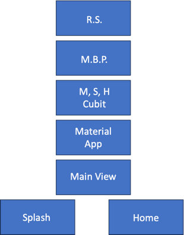

# space

A new Flutter project.

## Getting Started

This project is a starting point for a Flutter application.
The project is build on the flutter version (Channel stable, 3.0.4)
The project is build on the dart version (Dart version 2.17.5)

Project Architecture
The project is build on the Repository pattern architecture.

The project 4 layer

1. **View Layer** : This layer contains the UI.
2. **Bloc Layer** : This layer contains the bloc and the bloc event.
3. **Repo Layer** : This layer contains the repo and the repo event.
4. **Service Layer** : This layer contains the service and the service event.

We have three module in this project

1. **main** : This is the main module, which contains the other two module.
2. **splash** : This is the splash screen module
3. **home**    : This is the home screen module

Splash
This module contains the splash screen and the splash screen view.

Home
This module contains the home screen and the home screen view, service , repo, model and widgets.
1. **BLOC** : This module contains bloc which is used to handle the business logic.
2. **MODEL** : This module contains the model which is used to handle the data.
3. **REPO** : This module contains the repo which is used to handle the data from the service.
4. **SERVICE** : This module contains the service which is used to handle the data from the api.
5. **WIDGETS** : This module contains the widgets which is used to handle the UI.
6. **VIEW** : This module contains the view which is used to handle the UI.
7. **UTILS** : This module contains the utils which is used to handle the common function.

Widget Tree

